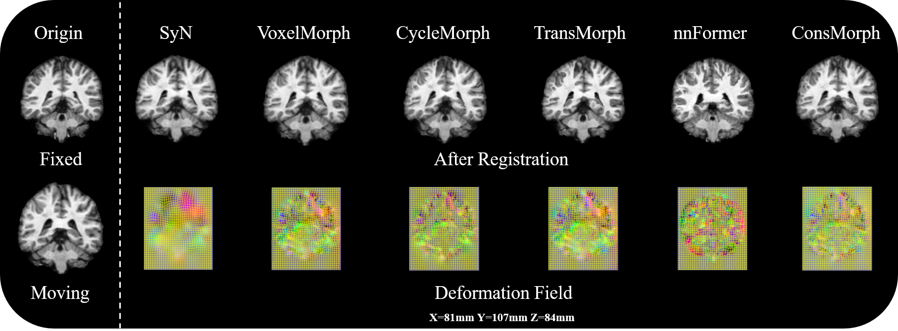

# DeepLearning_UCAS2022_registration

This repository is used to manage our team's code and document sharing. I hope everyone can gain a lot from this cooperation.
At present, our cooperation has been completed. All our codes can be found in the master branch. Team member yjzhong also provides the codes of nnFormer and TransMorph. For details, see the **yjzhong branch**


# Dataset

You can download the dataset in MICCAI chanllenge ,url: https://learn2reg.grand-challenge.org/Datasets/

or You can download the dataset in Baidu cloud:
链接：https://pan.baidu.com/s/1GN2_7KHCeZEvX5ECdQ4A3g 
提取码：wsgk 


## Result

| model      | DSC            | Affine DSC     | Jacobian    | alpha |
| ---------- | -------------- | -------------- | ----------- | ----- |
| ConsMorph  | 0.772 +- 0.032 | 0.588 +- 0.059 | 0.00461421  | 1     |
| CycleMorph | 0.703 +- 0.040 | 0.588 +- 0.059 | 0.007853651 | 1     |
| TransMorph | 0.796 +- 0.022 | 0.588 +- 0.059 | 0.005144969 | 1     |
| SyN        | 0.769 +- 0.029 | 0.588 +- 0.059 | 2.78E-06    | 1     |
| VoxelMorph | 0.772 +- 0.034 | 0.588 +- 0.059 | 0.000511589 | 1     |
| nnFormer   | 0.821 +- 0.023 | 0.565 +- 0.077 | 0.010476237 | 1     |
| nnFormer   | 0.807 +- 0.054 | 0.565 +- 0.077 | 0.005107598 | 5     |
| ConsMorph  | 0.758 +- 0.037 | 0.588 +- 0.059 | 5.06E-05    | 5     |




## Requirement installation

```shell
conda install pytorch torchvision torchaudio cudatoolkit=11.3 -c pytorch
conda install batchgenerators
conda install natsort
conda install pystrum
conda install nibabel
conda install ml_collections
conda install timm
```

## Models

If you want to reproduce our work, you can do it with the following command !

### VoxelMorph

- **Train**

```shell
python ./script/VoxelMoprh/train.py
```

- **Test**

```shell
python ./script/VoxelMoprh/infer.py
```

- **file description**

|   file/folder    |                           function                           |
| :--------------: | :----------------------------------------------------------: |
|       data       |                   Generate dataset inputs                    |
|      Model       |        The overall framework of the VoxelMorph model         |
|     infer.py     |                          test model                          |
|    losses.py     |                        Loss function                         |
| seg35_labels.txt | Segmentation map label description, used to finally calculate the **dsc** for each class |
|     train.py     |                         train model                          |
|     utils.py     | Basic functions and classes that compute some metrics and implement some basic transformations |

### CycleMorph

- **Train**

```shell
python ./script/CycleMoprh/train_CycleMorph.py
```

- **Test**

```shell
python ./script/CycleMoprh/infer.py
```

- **file description**

|     file/folder     |                           function                           |
| :-----------------: | :----------------------------------------------------------: |
|        data         |                   Generate dataset inputs                    |
|        Model        |        The overall framework of the CycleMoprh model         |
|      infer.py       |                          test model                          |
|      losses.py      |                        Loss function                         |
|  seg35_labels.txt   | Segmentation map label description, used to finally calculate the **dsc** for each class |
| train_CycleMorph.py |                         train model                          |
|      utils.py       | Basic functions and classes that compute some metrics and implement some basic transformations |

### ConsMorph

- **Train**

```shell
python ./script/ConsMoprh/train_Consmorph.py
```

- **Test**

```shell
python ./script/ConsMoprh/infer.py
```

- **file description**

|     file/folder     |                           function                           |
| :-----------------: | :----------------------------------------------------------: |
|        data         |                   Generate dataset inputs                    |
|        Model        |         The overall framework of the ConsMoprh model         |
|      infer.py       |                          test model                          |
|      losses.py      |                        Loss function                         |
|  seg35_labels.txt   | Segmentation map label description, used to finally calculate the **dsc** for each class |
| train_CycleMorph.py |                         train model                          |
|      utils.py       | Basic functions and classes that compute some metrics and implement some basic transformations |

### TransMorph

- Train

  ```shell
  python ./script/TransMorph/train_TransMorph.py
  ```

- Test

  ```shell
  python ./script/TransMorph/infer_TransMorph.py
  ```

- 代码文件说明

  |      file/folder      |                             作用                             |
  | :-------------------: | :----------------------------------------------------------: |
  |         data          |                   Generate dataset inputs                    |
  |        models         |        The overall framework of the TransMorph model         |
  | convert_nii_to_pkl.py |                  Convert nii.gz file to pkl                  |
  |  infer_TransMorph.py  |                          test model                          |
  |       losses.py       |                        Loss function                         |
  |   seg35_labels.txt    | Segmentation map label description, used to finally calculate the **dsc** for each class |
  |  train_TransMorph.py  |                         train model                          |
  |       utils.py        | Basic functions and classes that compute some metrics and implement some basic transformations |

### nnFormer

- 训练模型

  ```shell
  python ./script/nnFormer/train_TransMorph.py
  ```

- 测试模型

  ```shell
  python ./script/nnFormer/infer_TransMorph.py
  ```

- 代码文件说明

  |    文件/文件夹    |                             作用                             |
  | :---------------: | :----------------------------------------------------------: |
  |       data        |                   Generate dataset inputs                    |
  |      models       |         The overall framework of the nnFormer model          |
  |  img0438.nii.gz   | The data of the subject numbered 0438 in the test set is used to obtain affine in the test phase |
  | infer_nnFormer.py |                          test model                          |
  |     losses.py     |                        Loss function                         |
  | seg35_labels.txt  | Segmentation map label description, used to finally calculate the **dsc** for each class |
  | train_nnFormer.py |                         train model                          |
  |     utils.py      |         计算一些指标和实现一些基本变换的基本函数和类         |
  |  val_nnFormer.py  |                      Evaluate the model                      |

### SyN

- 测试模型

  ```shell
  python ./script/SyN/infer_SyN.py
  ```

- 代码文件说明

  |   文件/文件夹    |                             作用                             |
  | :--------------: | :----------------------------------------------------------: |
  |       data       |                   Generate dataset inputs                    |
  |   infer_SyN.py   |                          test model                          |
  | seg35_labels.txt | Segmentation map label description, used to finally calculate the **dsc** for each class |
  |     utils.py     |         计算一些指标和实现一些基本变换的基本函数和类         |

## Reference:

<a href="https://github.com/junyuchen245/TransMorph_Transformer_for_Medical_Image_Registration.git">TransMorph</a>
=======

# To be updated later.....

